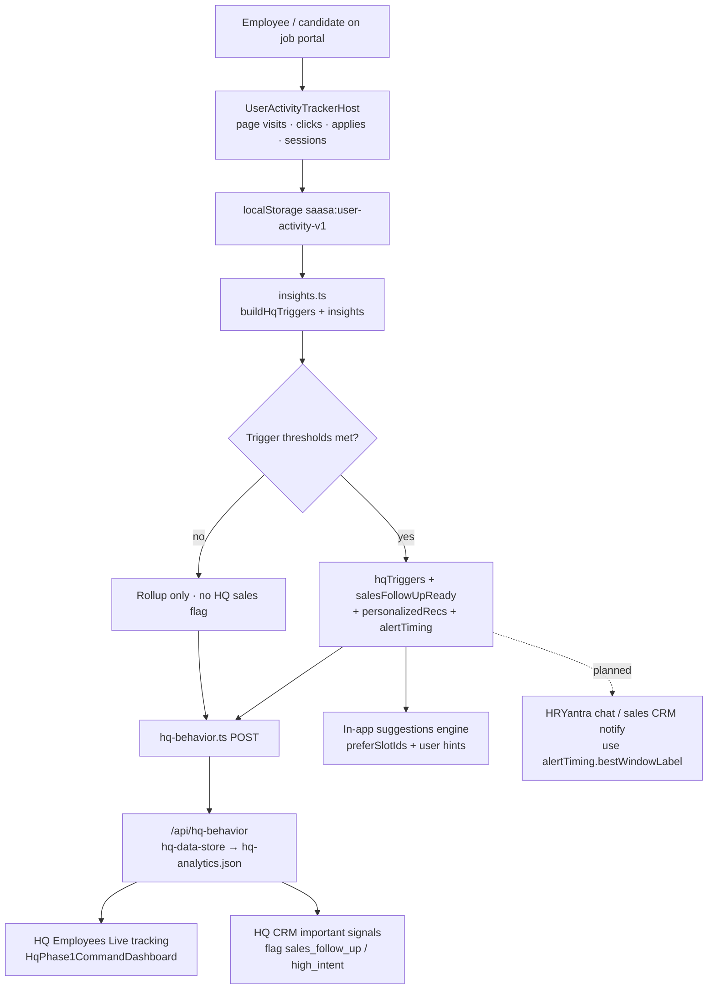
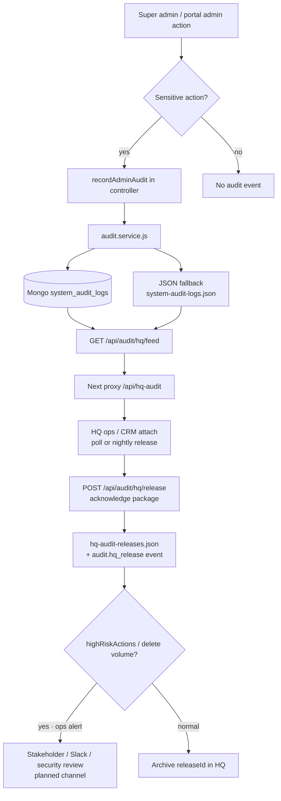
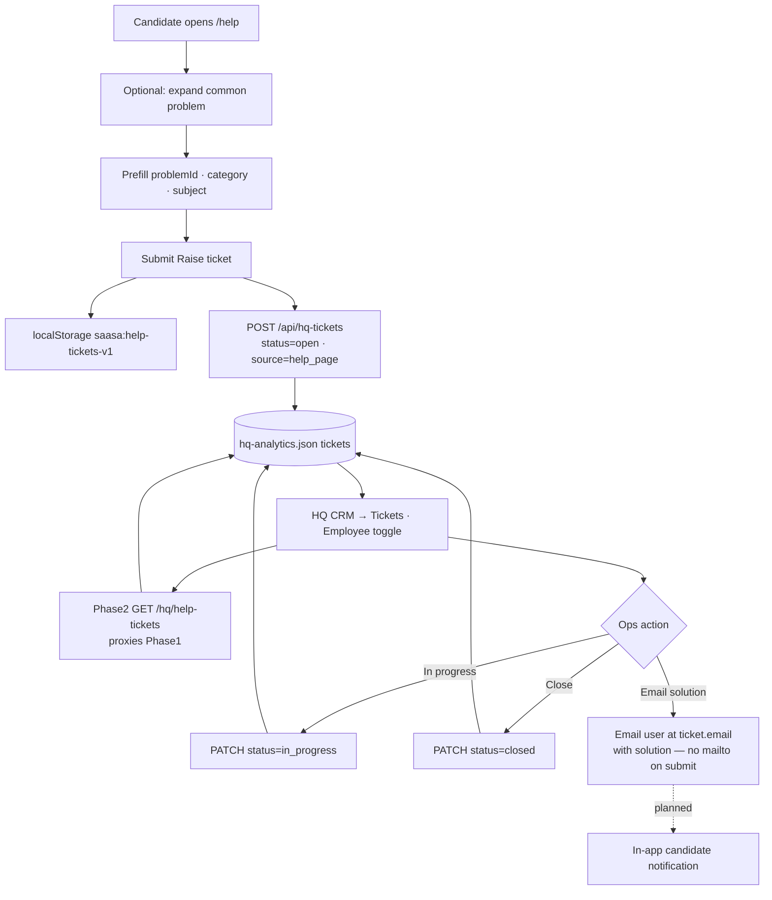
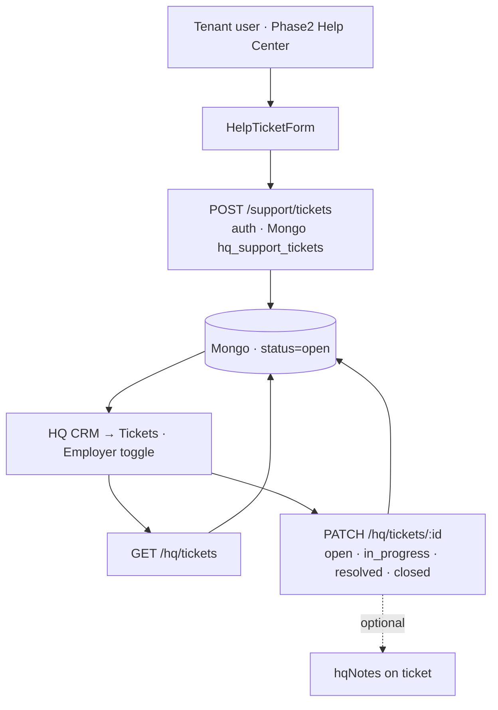

# HQ API test cheatsheet (Behavior · System audit · Tickets)

Copy-paste commands to **hit APIs directly** in a terminal (or paste GET URLs in a browser).  
Use this when demoing / verifying local or deployed Phase 1.

Related deep docs:

- [`HQ_BEHAVIOR_API.md`](./HQ_BEHAVIOR_API.md) — behaviour payload & modes
- [`AUDIT_LOGS.md`](./AUDIT_LOGS.md) — system audit architecture
- [`HQ_HELP_TICKETS_API.md`](./HQ_HELP_TICKETS_API.md) — help tickets contract
- [`HQ_DASHBOARD_STATS_SPEC.md`](./HQ_DASHBOARD_STATS_SPEC.md) — Employees dashboard stats (uses behaviour + tickets)

Paths below are clickable from this repo (relative to `jobportal_himanshu/`).

**In this doc**

| Section | Contents |
|---------|----------|
| §1 Behaviour | Data flowchart Employee → HQ + trigger thresholds (sales / CRM / user) |
| §2 System audit | Data flowchart Admin → HQ + audit action triggers |
| §3 Help tickets | Flowcharts Employee→HQ and Employer→HQ + ticket status triggers |
| §0 / §4–§8 | Base URLs, curl cheats, file links |

---

## 0. Set base URLs (run once per shell)

### Local (default ports)

```bash
# PowerShell
$FE  = "http://localhost:3000"   # jobportal Next (Phase 1 frontend)
$API = "http://localhost:5000"   # backend1
$KEY = $env:SYSTEM_AUDIT_ADMIN_KEY
if (-not $KEY) { $KEY = $env:INTERVIEW_ADMIN_KEY }
if (-not $KEY) { $KEY = "dev-admin-key" }   # only if your local .env uses this
```

```bash
# bash / mac / linux / Git Bash
export FE="http://localhost:3000"
export API="http://localhost:5000"
export KEY="${SYSTEM_AUDIT_ADMIN_KEY:-${INTERVIEW_ADMIN_KEY:-dev-admin-key}}"
```

### Deployed (replace hosts with your live domains)

```bash
# PowerShell — example production hosts (edit to match your deploy)
$FE  = "https://hryantra.com"              # Phase 1 frontend / Vercel
$API = "https://api.hryantra.com"          # backend1 public API (edit if different)
$KEY = "<YOUR_PRODUCTION_SYSTEM_AUDIT_ADMIN_KEY>"
```

```bash
# bash
export FE="https://hryantra.com"
export API="https://api.hryantra.com"
export KEY="<YOUR_PRODUCTION_SYSTEM_AUDIT_ADMIN_KEY>"
```

**Tips**

| Tip | Detail |
|-----|--------|
| Browser | Any `GET` URL below can be opened in Chrome (no body). |
| Pretty JSON | Append `\| ConvertFrom-Json \| ConvertTo-Json -Depth 12` (PowerShell) or pipe to `jq`. |
| Admin key | Audit + sessions need header `x-internal-admin-key`. Behavior + tickets Next routes usually do **not**. |
| Local open | If `SYSTEM_AUDIT_ADMIN_KEY` is unset on backend1, audit may allow local without key — still send the header in prod. |

---

## 1. Behaviour engine (`/api/hq-behavior`)

**Origin:** Phase 1 frontend (`$FE`). Stored in [`data/hq-analytics.json`](./data/hq-analytics.json).

### Related source files

| Role | File |
|------|------|
| Next API route | [`src/app/api/hq-behavior/route.ts`](./src/app/api/hq-behavior/route.ts) |
| Client forward / payload builder | [`src/lib/hq-behavior.ts`](./src/lib/hq-behavior.ts) |
| Persist realtime / latest / history / tickets | [`src/lib/hq-data-store.ts`](./src/lib/hq-data-store.ts) |
| Activity capture host | [`src/components/common/UserActivityTrackerHost.tsx`](./src/components/common/UserActivityTrackerHost.tsx) |
| Activity store | [`src/lib/user-activity-tracker/store.ts`](./src/lib/user-activity-tracker/store.ts) |
| Insights / triggers | [`src/lib/user-activity-tracker/insights.ts`](./src/lib/user-activity-tracker/insights.ts) |
| Interest affinity snapshot | [`src/lib/interest-affinity-store.ts`](./src/lib/interest-affinity-store.ts) |
| Sessions Next proxy | [`src/app/api/hq-sessions/route.ts`](./src/app/api/hq-sessions/route.ts) |
| Sessions backend controller | [`../../job-seek-backend/hrayntra_aws/backend1/src/controllers/hq-sessions.controller.js`](../../job-seek-backend/hrayntra_aws/backend1/src/controllers/hq-sessions.controller.js) |
| Sessions backend routes | [`../../job-seek-backend/hrayntra_aws/backend1/src/routes/hq.routes.js`](../../job-seek-backend/hrayntra_aws/backend1/src/routes/hq.routes.js) |
| HQ Employees live tracking UI | [`../../job-seek-backend/hrayntra_aws/frontphase2/src/components/hq/analytics/HqPhase1CommandDashboard.tsx`](../../job-seek-backend/hrayntra_aws/frontphase2/src/components/hq/analytics/HqPhase1CommandDashboard.tsx) |
| HQ analytics aggregates behaviour | [`../../job-seek-backend/hrayntra_aws/backendphase2/src/modules/hq/hq-analytics.service.js`](../../job-seek-backend/hrayntra_aws/backendphase2/src/modules/hq/hq-analytics.service.js) |
| Spec doc | [`HQ_BEHAVIOR_API.md`](./HQ_BEHAVIOR_API.md) |

### Data flow (Employee portal → HQ)



**Steps (sorted)**

1. Candidate uses portal (jobs, premium, CV, gossip, LMS…).  
2. Tracker stores activity locally.  
3. `insights.ts` computes rollups + **hqTriggers** when thresholds fire.  
4. Client `POST /api/hq-behavior` → realtime / latest / history in `hq-analytics.json`.  
5. HQ Employees dashboard + CRM “Important · CRM” read triggers for sales follow-up.  
6. Same triggers drive in-app suggestion slots; chat/CRM push is planned using `alertTiming`.

### Trigger points & values (Behaviour → user / sales / CRM)

Source: [`insights.ts`](./src/lib/user-activity-tracker/insights.ts) · window = **last 7 days** unless noted.

| Trigger id | Flag → queue | Audience | Fires when (threshold) | Notify / action |
|------------|--------------|----------|------------------------|-----------------|
| `hq_service_no_purchase` | `sales_follow_up` | hq | premium visits **≥ 3** AND applies **= 0** | Sales call · package pitch |
| `hq_premium_plus_intent` | `sales_follow_up` | hq | premium **≥ 2** AND (company **≥ 3** OR role **≥ 3**) | Warm HQ lead · tied package |
| `hq_shallow_premium_browse` | `sales_follow_up` | hq | `short_sessions` insight AND premium **≥ 2** | Short nurture (not hard sell) |
| `hq_keyword_ats_gap` | `sales_follow_up` | both | CV **≥ 70** AND rejections **≥ 3** AND apps **≥ 4** AND (skills **≤ 4** OR incomplete profile OR marketFit **&lt; 65**) | User: AI CV tailor · Sales: ATS package |
| `hq_company_high_intent` | `high_intent` | both | same company interactions **≥ 4** | Jobs / reference / prep for company |
| `hq_company_research_no_apply` | `high_intent` | both | company **≥ 3** AND community visits **≥ 3** AND applies **≤ 1** | Apply nudge · company intel package |
| `hq_role_research` | `career_assist` | both | same role **≥ 4** | Matching jobs / courses / mock interview |
| `hq_interview_stage_loss` | `career_assist` | both | post-interview rejections **≥ 2** AND (CV ≥ 70 OR apps ≥ 4) | Mock interview · paid coaching |
| `hq_role_skill_mismatch` | `career_assist` | both | role **≥ 3** AND (skill/keyword rejection insight OR rejections ≥ 2 with skills ≤ 5) | LMS + CV keyword bundle |
| `hq_ready_but_not_applying` | `career_assist` | both | browse/skills insights AND skills **≥ 3** | One-click apply · coaching |
| `hq_low_market_fit` | `career_assist` | both | marketFit **&lt; 55** AND (apps ≥ 3 OR job clicks ≥ 6) | Gap coach · consultation |
| `hq_cv_risk` | `watch` | both | rejection_cv_issue AND CV **&lt; 70** | AI CV first |
| `hq_cv_hesitation` | `user_nudge` | both | CV time **≥ 6 min** AND applies **≤ 1** (or cv_edit_hesitation) | Apply nudge |
| `hq_profile_incomplete_job_hunter` | `user_nudge` | both | missingSections **≥ 2** OR completeness **&lt; 75**, AND (job clicks ≥ 5 OR jobs time ≥ 4 min) | Finish profile |
| `hq_learn_then_target_role` | `user_nudge` | both | `lms_heavy` AND role **≥ 2** | Bridge LMS → jobs |

**CRM / sales score fields on payload**

| Field | Meaning |
|-------|---------|
| `salesFollowUpReady` | true when sales-oriented triggers present |
| `salesFollowUpScore` | 0–100 priority for HQ sales queue |
| `salesQueueReason` | human reason string |
| `alertTiming.bestWindowLabel` | best hour/window to push HRYantra / nudge |
| `triggers[].priority` | higher = act first (e.g. 93 premium+intent, 92 keyword gap) |
| `triggers[].audience` | `hq` = ops/sales only · `both` = user nudge + HQ · `user` = in-app |

**Not ticket triggers** — these are behavioural sales/career flags, not Help-desk tickets.

### Browser (local)

```
http://localhost:3000/api/hq-behavior
http://localhost:3000/api/hq-behavior?mode=realtime
http://localhost:3000/api/hq-behavior?mode=latest&userId=REPLACE_USER_ID
http://localhost:3000/api/hq-behavior?mode=history&userId=REPLACE_USER_ID
```

### Browser (deployed)

```
https://hryantra.com/api/hq-behavior
https://hryantra.com/api/hq-behavior?mode=realtime
https://hryantra.com/api/hq-behavior?mode=latest&userId=REPLACE_USER_ID
https://hryantra.com/api/hq-behavior?mode=history&userId=REPLACE_USER_ID
```

### CMD / PowerShell — list realtime

```powershell
curl.exe -s "$FE/api/hq-behavior"
curl.exe -s "$FE/api/hq-behavior?mode=realtime"
```

```bash
curl -s "$FE/api/hq-behavior"
curl -s "$FE/api/hq-behavior?mode=realtime"
```

### One user — latest + history

```powershell
$USER = "REPLACE_USER_ID"
curl.exe -s "$FE/api/hq-behavior?mode=latest&userId=$USER"
curl.exe -s "$FE/api/hq-behavior?mode=history&userId=$USER"
```

```bash
USER="REPLACE_USER_ID"
curl -s "$FE/api/hq-behavior?mode=latest&userId=$USER"
curl -s "$FE/api/hq-behavior?mode=history&userId=$USER"
```

### Sessions (login / geo / alert timing) — Next proxy → backend1

```powershell
curl.exe -s -H "x-internal-admin-key: $KEY" "$FE/api/hq-sessions"
curl.exe -s -H "x-internal-admin-key: $KEY" "$FE/api/hq-sessions?userId=REPLACE_USER_ID"
```

```bash
curl -s -H "x-internal-admin-key: $KEY" "$FE/api/hq-sessions"
curl -s -H "x-internal-admin-key: $KEY" "$FE/api/hq-sessions?userId=REPLACE_USER_ID"
```

Direct backend1 (same data):

```powershell
curl.exe -s -H "x-internal-admin-key: $KEY" "$API/api/hq/sessions?limit=20"
curl.exe -s -H "x-internal-admin-key: $KEY" "$API/api/hq/sessions/REPLACE_USER_ID?limit=20"
```

---

## 2. System audit (`/api/hq-audit` + `/api/audit/...`)

**Origin:** Prefer Next proxy `$FE/api/hq-audit` (one URL for HQ).  
Or hit backend1 `$API/api/audit/...` with the same admin key.

### Related source files

| Role | File |
|------|------|
| Next HQ proxy | [`src/app/api/hq-audit/route.ts`](./src/app/api/hq-audit/route.ts) |
| Backend routes | [`../../job-seek-backend/hrayntra_aws/backend1/src/routes/audit.routes.js`](../../job-seek-backend/hrayntra_aws/backend1/src/routes/audit.routes.js) |
| Backend controller | [`../../job-seek-backend/hrayntra_aws/backend1/src/controllers/audit.controller.js`](../../job-seek-backend/hrayntra_aws/backend1/src/controllers/audit.controller.js) |
| Audit service (Mongo + JSON fallback) | [`../../job-seek-backend/hrayntra_aws/backend1/src/services/audit.service.js`](../../job-seek-backend/hrayntra_aws/backend1/src/services/audit.service.js) |
| Admin key middleware | [`../../job-seek-backend/hrayntra_aws/backend1/src/middleware/system-admin.middleware.js`](../../job-seek-backend/hrayntra_aws/backend1/src/middleware/system-admin.middleware.js) |
| Mount on server | [`../../job-seek-backend/hrayntra_aws/backend1/src/server.js`](../../job-seek-backend/hrayntra_aws/backend1/src/server.js) (`app.use('/api/audit', …)`) |
| JSON fallback store | [`../../job-seek-backend/hrayntra_aws/backend1/data/system-audit-logs.json`](../../job-seek-backend/hrayntra_aws/backend1/data/system-audit-logs.json) |
| HQ release packages file | [`../../job-seek-backend/hrayntra_aws/backend1/data/hq-audit-releases.json`](../../job-seek-backend/hrayntra_aws/backend1/data/hq-audit-releases.json) |
| Spec doc | [`AUDIT_LOGS.md`](./AUDIT_LOGS.md) |

### Data flow (Admin / Employer ops → HQ)



**Steps (sorted)**

1. Admin deletes candidate/job, approves interviewer, or writes custom audit event.  
2. `recordAdminAudit` writes Mongo (primary) or JSON fallback.  
3. HQ polls `GET /api/hq-audit` (or `/api/audit/hq/feed`) for events + prior releases.  
4. Nightly / manual `POST` release packages a window of events.  
5. HQ stores `releaseId`; high-risk deletes can drive ops alerts.

### Trigger points & values (Audit → HQ / security / CRM)

These are **admin accountability** triggers, not candidate sales nudges.

| Action id | When it fires | Entity | Who sees / notify |
|-----------|---------------|--------|-------------------|
| `candidate.hard_delete` | Super admin deletes one candidate | candidate id | HQ audit feed · security / ops |
| `candidate.bulk_delete` | Super admin bulk delete | candidate ids | HQ · high-risk if volume spike |
| `job.delete` | Super admin deletes one job | job id | HQ audit feed |
| `job.bulk_delete` | Super admin bulk delete jobs | job ids | HQ · high-risk if volume spike |
| `interviewer.application_approve` | Admin approves interviewer app | application | HQ / ops |
| `interviewer.application_reject` | Admin rejects interviewer app | application | HQ / ops |
| `audit.hq_release` | HQ release package persisted | releaseId | Confirms ingest · CRM attach |
| Custom `POST /api/audit/events` | Tooling writes `action` + metadata | any | HQ if polled |

**Release / feed knobs**

| Param | Typical value | Effect |
|-------|---------------|--------|
| `sinceHours` | `24` | Window of events in feed / release |
| `limit` | `50`–`200` | Cap events returned |
| `acknowledge: true` | on POST release | Persist package for HQ |
| `hqSystemId` | e.g. `hq-crm` | Labels which HQ system pulled |

**Escalate when** `summary.highRiskActions` is non-empty or delete `eventCount` exceeds your ops threshold (see [`AUDIT_LOGS.md`](./AUDIT_LOGS.md) checklist).

### Browser (local) — feed

```
http://localhost:3000/api/hq-audit
http://localhost:3000/api/hq-audit?sinceHours=24&limit=50
http://localhost:3000/api/hq-audit?mode=release&sinceHours=24&limit=100
http://localhost:3000/api/hq-audit?mode=events&limit=50
```

### Browser (deployed)

```
https://hryantra.com/api/hq-audit
https://hryantra.com/api/hq-audit?sinceHours=24&limit=50
https://hryantra.com/api/hq-audit?mode=release&sinceHours=24
https://hryantra.com/api/hq-audit?mode=events&limit=50
```

> If the proxy requires a key and browser calls fail, use curl with the header below.

### CMD — HQ feed (via Next proxy)

```powershell
curl.exe -s -H "x-internal-admin-key: $KEY" "$FE/api/hq-audit?sinceHours=24&limit=50"
curl.exe -s -H "x-internal-admin-key: $KEY" "$FE/api/hq-audit?mode=release&sinceHours=24&limit=100"
curl.exe -s -H "x-internal-admin-key: $KEY" "$FE/api/hq-audit?mode=events&limit=50"
```

```bash
curl -s -H "x-internal-admin-key: $KEY" "$FE/api/hq-audit?sinceHours=24&limit=50"
curl -s -H "x-internal-admin-key: $KEY" "$FE/api/hq-audit?mode=release&sinceHours=24&limit=100"
curl -s -H "x-internal-admin-key: $KEY" "$FE/api/hq-audit?mode=events&limit=50"
```

### CMD — direct backend1 (same APIs)

```powershell
curl.exe -s -H "x-internal-admin-key: $KEY" "$API/api/audit/hq/feed?sinceHours=24&limit=50"
curl.exe -s -H "x-internal-admin-key: $KEY" "$API/api/audit/hq/release?sinceHours=24&limit=200"
curl.exe -s -H "x-internal-admin-key: $KEY" "$API/api/audit/events?limit=50"
curl.exe -s -H "x-internal-admin-key: $KEY" "$API/api/audit/hq/releases"
```

### Persist an HQ release package (POST)

```powershell
curl.exe -s -X POST "$FE/api/hq-audit" `
  -H "Content-Type: application/json" `
  -H "x-internal-admin-key: $KEY" `
  -d "{\"sinceHours\":24,\"limit\":200,\"acknowledge\":true,\"hqSystemId\":\"hq-demo\",\"note\":\"Manual test release\"}"
```

```bash
curl -s -X POST "$FE/api/hq-audit" \
  -H "Content-Type: application/json" \
  -H "x-internal-admin-key: $KEY" \
  -d '{"sinceHours":24,"limit":200,"acknowledge":true,"hqSystemId":"hq-demo","note":"Manual test release"}'
```

Direct backend1 equivalent:

```bash
curl -s -X POST "$API/api/audit/hq/release" \
  -H "Content-Type: application/json" \
  -H "x-internal-admin-key: $KEY" \
  -d '{"sinceHours":24,"limit":200,"acknowledge":true,"hqSystemId":"hq-demo","note":"Manual test release"}'
```

---

## 3. Help tickets (`/api/hq-tickets`)

**Origin:** Phase 1 frontend (`$FE`). Raised from `/help` (register only — no mail app).  
HQ CRM → **Tickets** reads these via Phase 2 proxy `GET /hq/help-tickets`.

### Related source files

| Role | File |
|------|------|
| Help page UI | [`src/app/(website)/help/page.tsx`](./src/app/(website)/help/page.tsx) |
| Problems + categories + client POST | [`src/app/(website)/help/data/problems.ts`](./src/app/(website)/help/data/problems.ts) |
| Next API route | [`src/app/api/hq-tickets/route.ts`](./src/app/api/hq-tickets/route.ts) |
| Persist append / list / status | [`src/lib/hq-data-store.ts`](./src/lib/hq-data-store.ts) |
| Storage (shared with behaviour) | [`data/hq-analytics.json`](./data/hq-analytics.json) |
| Website layout (Header on `/help`) | [`src/app/(website)/layout.tsx`](./src/app/(website)/layout.tsx) |
| HQ CRM Tickets page | [`../../job-seek-backend/hrayntra_aws/frontphase2/src/app/hq/tickets/page.tsx`](../../job-seek-backend/hrayntra_aws/frontphase2/src/app/hq/tickets/page.tsx) |
| HQ Tickets UI (Employee / Employer toggle) | [`../../job-seek-backend/hrayntra_aws/frontphase2/src/components/hq/HqCrmHelpTicketsPanel.tsx`](../../job-seek-backend/hrayntra_aws/frontphase2/src/components/hq/HqCrmHelpTicketsPanel.tsx) |
| HQ API client (`apiHqListHelpTickets`) | [`../../job-seek-backend/hrayntra_aws/frontphase2/src/lib/api.ts`](../../job-seek-backend/hrayntra_aws/frontphase2/src/lib/api.ts) |
| Phase 2 proxy service → Phase 1 tickets | [`../../job-seek-backend/hrayntra_aws/backendphase2/src/modules/hq/hq-help-tickets.service.js`](../../job-seek-backend/hrayntra_aws/backendphase2/src/modules/hq/hq-help-tickets.service.js) |
| Phase 2 routes (`/hq/help-tickets`) | [`../../job-seek-backend/hrayntra_aws/backendphase2/src/modules/hq/hq.routes.js`](../../job-seek-backend/hrayntra_aws/backendphase2/src/modules/hq/hq.routes.js) |
| Employer (tenant) tickets service (separate) | [`../../job-seek-backend/hrayntra_aws/backendphase2/src/modules/hq/hq-tickets.service.js`](../../job-seek-backend/hrayntra_aws/backendphase2/src/modules/hq/hq-tickets.service.js) |
| Spec doc | [`HQ_HELP_TICKETS_API.md`](./HQ_HELP_TICKETS_API.md) |

### Data flow A — Employee (candidate) → HQ CRM



### Data flow B — Employer (tenant) → HQ CRM



**Steps (sorted) — Employee**

1. User submits `/help` → ticket registered only (no mail app).  
2. Stored in `hq-analytics.json` via `/api/hq-tickets`.  
3. HQ CRM **Tickets → Employee** lists open queue.  
4. Ops sets `in_progress` / `closed` via PATCH.  
5. Ops emails solution to user; in-app bell planned later.

**Steps (sorted) — Employer**

1. Tenant raises ticket from Phase 2 Help Center.  
2. Mongo `hq_support_tickets` via `/support/tickets`.  
3. HQ CRM **Tickets → Employer** acts with status + notes.

### Trigger points & values (Tickets → CRM / user)

| Trigger | System | Value / condition | What happens |
|---------|--------|-------------------|--------------|
| Form submit `/help` | Employee | Required: name, email, subject, description | `status=open`, `source=help_page`, append ticket |
| Prefill “Raise ticket for this” | Employee | `problemId` from common problems table | Category + subject prefilled |
| HQ list open queue | Employee | `GET ?status=open` | CRM Employee tab queue |
| HQ mark in progress | Employee | `PATCH status=in_progress` | Ops working · **no auto user notify yet** |
| HQ close | Employee | `PATCH status=closed` | Done · email solution manually / later notify |
| Tenant Help submit | Employer | subject + description required | Mongo ticket `open` |
| HQ status Employer | Employer | `open` \| `in_progress` \| `resolved` \| `closed` | Tenant support workflow |
| Priority Employer | Employer | `low` \| `medium` \| `high` \| `urgent` | Sort / escalate in CRM |
| High / urgent count | Employer | stats `highPriority` | Ops attention KPI |

**Employee ticket categories (form)** — Login & account · Jobs & applications · Profile & CV · Tokens & payments · Office Gossips · Reference check · LMS & interview prep · Employers · Other  

**Common `problemId` prefills** — `login-otp`, `duplicate-email-phone`, `few-jobs`, `apply-failed`, `tokens`, `og-setup`, `hryantra-alerts`, `reference-check`, `profile-save`, `employer-access` (see [`HQ_HELP_TICKETS_API.md`](./HQ_HELP_TICKETS_API.md)).

**Notification truth today**

| Channel | Employee tickets | Employer tickets | Behaviour sales flags |
|---------|------------------|------------------|------------------------|
| Auto open mail app on submit | No | No | N/A |
| HQ CRM visible | Yes (`/hq/tickets` Employee) | Yes (Employer toggle) | Yes (Live tracking / CRM signals) |
| Email user with solution | Manual ops (promised on `/help`) | Manual / tenant flow | Sales call / WhatsApp using triggers |
| In-app bell on status change | Planned | Not wired as help-ticket bell | Planned via HRYantra + `alertTiming` |

### Browser (local)

```
http://localhost:3000/api/hq-tickets
http://localhost:3000/api/hq-tickets?status=open
http://localhost:3000/api/hq-tickets?status=in_progress
http://localhost:3000/api/hq-tickets?status=closed
http://localhost:3000/api/hq-tickets?email=user@email.com
http://localhost:3000/api/hq-tickets?id=tkt_REPLACE
```

### Browser (deployed)

```
https://hryantra.com/api/hq-tickets
https://hryantra.com/api/hq-tickets?status=open
https://hryantra.com/api/hq-tickets?email=user@email.com
https://hryantra.com/api/hq-tickets?id=tkt_REPLACE
```

### CMD — list / filter

```powershell
curl.exe -s "$FE/api/hq-tickets"
curl.exe -s "$FE/api/hq-tickets?status=open"
curl.exe -s "$FE/api/hq-tickets?limit=50"
curl.exe -s "$FE/api/hq-tickets?email=user@email.com"
curl.exe -s "$FE/api/hq-tickets?id=tkt_REPLACE"
```

```bash
curl -s "$FE/api/hq-tickets"
curl -s "$FE/api/hq-tickets?status=open"
curl -s "$FE/api/hq-tickets?limit=50"
curl -s "$FE/api/hq-tickets?email=user@email.com"
curl -s "$FE/api/hq-tickets?id=tkt_REPLACE"
```

### Create a ticket (simulate `/help` submit)

```powershell
curl.exe -s -X POST "$FE/api/hq-tickets" `
  -H "Content-Type: application/json" `
  -d "{\"name\":\"Demo User\",\"email\":\"demo@example.com\",\"category\":\"Login & account\",\"subject\":\"API test ticket\",\"description\":\"Created from curl cheatsheet\",\"problemId\":\"login-otp\",\"userId\":null}"
```

```bash
curl -s -X POST "$FE/api/hq-tickets" \
  -H "Content-Type: application/json" \
  -d '{
    "name": "Demo User",
    "email": "demo@example.com",
    "category": "Login & account",
    "subject": "API test ticket",
    "description": "Created from curl cheatsheet",
    "problemId": "login-otp",
    "userId": null
  }'
```

### Update status (HQ action)

```powershell
curl.exe -s -X PATCH "$FE/api/hq-tickets" `
  -H "Content-Type: application/json" `
  -d "{\"id\":\"tkt_REPLACE\",\"status\":\"in_progress\"}"

curl.exe -s -X PATCH "$FE/api/hq-tickets" `
  -H "Content-Type: application/json" `
  -d "{\"id\":\"tkt_REPLACE\",\"status\":\"closed\"}"
```

```bash
curl -s -X PATCH "$FE/api/hq-tickets" \
  -H "Content-Type: application/json" \
  -d '{"id":"tkt_REPLACE","status":"in_progress"}'

curl -s -X PATCH "$FE/api/hq-tickets" \
  -H "Content-Type: application/json" \
  -d '{"id":"tkt_REPLACE","status":"closed"}'
```

Allowed `status`: `open` | `in_progress` | `closed`

---

## 4. One-shot demo script (local)

Run Phase 1 frontend on **3000** and backend1 on **5000**, then:

```powershell
$FE = "http://localhost:3000"
$API = "http://localhost:5000"
$KEY = $env:SYSTEM_AUDIT_ADMIN_KEY; if (-not $KEY) { $KEY = $env:INTERVIEW_ADMIN_KEY }; if (-not $KEY) { $KEY = "" }

Write-Host "`n=== BEHAVIOR ===" -ForegroundColor Cyan
curl.exe -s "$FE/api/hq-behavior?mode=realtime"

Write-Host "`n=== TICKETS (open) ===" -ForegroundColor Cyan
curl.exe -s "$FE/api/hq-tickets?status=open"

Write-Host "`n=== AUDIT FEED ===" -ForegroundColor Cyan
if ($KEY) {
  curl.exe -s -H "x-internal-admin-key: $KEY" "$FE/api/hq-audit?sinceHours=24&limit=20"
} else {
  curl.exe -s "$FE/api/hq-audit?sinceHours=24&limit=20"
}
```

```bash
export FE="http://localhost:3000"
export API="http://localhost:5000"
export KEY="${SYSTEM_AUDIT_ADMIN_KEY:-${INTERVIEW_ADMIN_KEY:-}}"

echo; echo "=== BEHAVIOR ==="
curl -s "$FE/api/hq-behavior?mode=realtime"

echo; echo "=== TICKETS (open) ==="
curl -s "$FE/api/hq-tickets?status=open"

echo; echo "=== AUDIT FEED ==="
if [ -n "$KEY" ]; then
  curl -s -H "x-internal-admin-key: $KEY" "$FE/api/hq-audit?sinceHours=24&limit=20"
else
  curl -s "$FE/api/hq-audit?sinceHours=24&limit=20"
fi
```

---

## 5. Quick map

| System | Local URL | Deployed URL (edit host) | Auth | Primary code |
|--------|-----------|--------------------------|------|----------------|
| Behaviour realtime | `http://localhost:3000/api/hq-behavior` | `https://hryantra.com/api/hq-behavior` | none | [`hq-behavior/route.ts`](./src/app/api/hq-behavior/route.ts) |
| Sessions | `…/api/hq-sessions` | same path on FE | `x-internal-admin-key` | [`hq-sessions/route.ts`](./src/app/api/hq-sessions/route.ts) |
| Audit feed | `…/api/hq-audit` | same path on FE | `x-internal-admin-key` (prod) | [`hq-audit/route.ts`](./src/app/api/hq-audit/route.ts) |
| Audit backend | `http://localhost:5000/api/audit/hq/feed` | `https://api…/api/audit/hq/feed` | `x-internal-admin-key` | [`audit.routes.js`](../../job-seek-backend/hrayntra_aws/backend1/src/routes/audit.routes.js) |
| Tickets list | `…/api/hq-tickets` | same path on FE | none | [`hq-tickets/route.ts`](./src/app/api/hq-tickets/route.ts) |
| Tickets create | `POST …/api/hq-tickets` | same | none | same + [`help/page.tsx`](./src/app/(website)/help/page.tsx) |
| Tickets status | `PATCH …/api/hq-tickets` | same | none | [`hq-data-store.ts`](./src/lib/hq-data-store.ts) |
| HQ CRM Tickets UI | `http://localhost:3001/hq/tickets` (HQ FE) | your HQ host `/hq/tickets` | HQ auth | [`HqCrmHelpTicketsPanel.tsx`](../../job-seek-backend/hrayntra_aws/frontphase2/src/components/hq/HqCrmHelpTicketsPanel.tsx) |

---

## 6. Expected healthy responses (shape)

**Behavior**

```json
{ "success": true, "data": { "users": [ /* … */ ] } }
```

**Tickets**

```json
{
  "success": true,
  "data": {
    "count": 1,
    "openCount": 1,
    "tickets": [ { "id": "tkt_…", "status": "open", "subject": "…" } ]
  }
}
```

**Audit feed**

```json
{
  "success": true,
  "data": {
    "events": [ /* … */ ],
    "releases": [ /* … */ ]
  }
}
```

Exact nesting may wrap under backend `message` / `data` — check the JSON you get; if `success: false`, read `message` / `error`.

---

## 7. Troubleshooting

| Symptom | Fix |
|---------|-----|
| Connection refused on 3000 | Start jobportal: `npm run dev` in `jobportal_himanshu` |
| Audit / sessions empty or 401 | Set `SYSTEM_AUDIT_ADMIN_KEY` on backend1 + pass header; start backend1 on 5000 |
| Tickets empty | Submit once on `/help`, or run the **Create a ticket** curl above |
| Deployed FE works, API fails | Confirm `$API` host and CORS / key match production secrets |
| Behavior empty | Browse the portal while logged in so heartbeats `POST /api/hq-behavior` |

---

## 8. Jump to module code

Each module section above has:

- **Related source files** (clickable paths)
- **Data flow** mermaid flowchart(s)
- **Trigger points & values** tables (what fires sales / CRM / user / ops)

1. Behaviour → §1  
2. System audit → §2  
3. Help tickets → §3  

---

## 9. Employers behaviour engine (Phase 2 HQ — stats + ids)

Separate from Phase 1 `/api/hq-behavior` and from HQ `GET /hq/tenants/:tenantDbName/behavior`.

**API:** `GET /api/v1/hq/tenants/:tenantDbName/behavior-engine` on **backendphase2** (`$P2`, local `http://localhost:5001`).

Doc: [`../../job-seek-backend/hrayntra_aws/backendphase2/EMPLOYER_BEHAVIOR_ENGINE_API.md`](../../job-seek-backend/hrayntra_aws/backendphase2/EMPLOYER_BEHAVIOR_ENGINE_API.md)

```powershell
$P2 = "http://localhost:5001"
$HQTOKEN = "<HQ JWT>"
$TENANT = "<tenantDbName>"
Invoke-RestMethod -Headers @{ Authorization = "Bearer $HQTOKEN" } `
  "$P2/api/v1/hq/tenants/$TENANT/behavior-engine?range=week"
```

Returns **tenantWide** activity/workload counts and **users[]** (userId + task/lead/job ids, no duplicated names). Optional `&userId=`.

Shared store for behaviour + employee tickets: [`src/lib/hq-data-store.ts`](./src/lib/hq-data-store.ts) → [`data/hq-analytics.json`](./data/hq-analytics.json).
